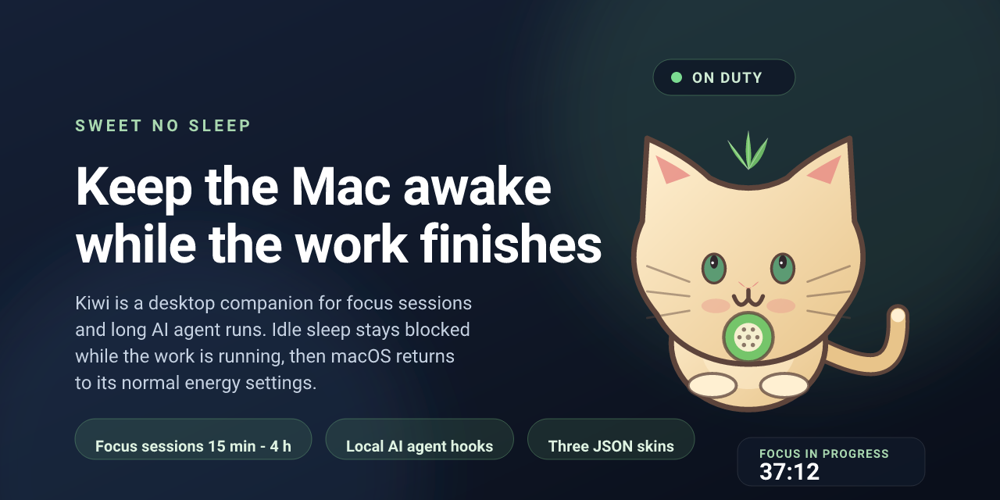

# Sweet No Sleep — Kiwi Cat

A native macOS desktop companion that reacts to interaction and helps keep a Mac awake during long-running work by users or AI agents.

## Release media



[Download the 1280 × 640 banner PNG](Resources/Art/Rendered/banner.png) · [editable banner SVG](Resources/Art/banner.svg) · [Open Graph SVG](Resources/Art/og-image.svg). The SVG files are the editable sources; `Scripts/render-media.sh` rebuilds raster assets on macOS. A successful macOS CI push commits the generated images to the task branch and uploads the media kit as an artifact.

## Features

- **Kiwi is drawn without external artwork:** breathing, blinking, a swaying tail, pointer-following eyes, click reactions, and drag-to-move.
- **Three JSON skin packs:** Kiwi, Moonlight, and Strawberry have separate palettes, motion profiles, and celebration effects. Add user packs without changing application source.
- **Occasional playful moments during an awake session:** a dance, stretch, or curious look roughly every 3.5–6.5 minutes; can be disabled independently.
- **Gentle break reminders:** by default, every 25 minutes of an awake session Kiwi suggests looking into the distance for about 20 seconds. Snooze, dismiss, or disable reminders.
- **Transparent floating panel:** does not activate the pet instead of the editor, can stay above windows and across Spaces, and remembers its position.
- **Optional screen roaming:** enable **Settings → Pet → Behavior**. The first stroll starts about 3 seconds after enabling; later strolls begin about every 28 seconds. Off by default.
- **Manual awake mode** without a timer and **focus sessions** from 15 minutes to 4 hours.
- **Configurable session completion:** release the assertion and let macOS use its normal sleep settings, or explicitly choose immediate sleep with confirmation for each session.
- **Separate display setting:** allow the display to turn off while the Mac and work remain awake.
- **Settings for size, visibility, animation, launch at login, skins, and agent hooks.** System Reduce Motion is respected.

## Build on Mac

Requirements: macOS 14+ and Xcode 16+ with the Swift 5.9+ toolchain.

```bash
# Run the Swift package
swift run --package-path /path/to/sweet-no-sleep

# Build a local .app bundle
cd /path/to/sweet-no-sleep
./Scripts/build-app.sh
open "dist/Sweet No Sleep — Kiwi Cat.app"
```

The build script produces a release binary, assembles a minimal `.app` bundle with the species-neutral leaf-and-kiwi-heart brand icon and companion media, copies skin and localization resources, and ad-hoc signs it for local use. Keep the app at a stable path if you enable launch at login. Distribution still requires Developer ID signing and notarization.

Run the portable checks before building; on macOS the check script also builds the Swift package:

```bash
./Scripts/check-project.sh
```

## Settings

Open the menu-bar item and choose **Settings**. This is the app's settings window, not a macOS Settings pane. It contains three sections:

- **Focus** — session duration, completion behavior, and manual awake mode.
- **Pet** — skin, size (90–170 pt), visibility, window level, roaming, animation, playful moments, and break reminders. Drag Kiwi on the desktop to reposition it.
- **Power** — display sleep, opt-in agent hooks, and launch at login.

To add a skin, open **Settings → Pet → Open skins folder**, copy a pack directory containing `skin.json`, choose **Refresh list**, and select its card. See [the skin authoring guide](docs/SKIN_AUTHORING.md) for the schema and a template.

## Check sleep protection

Enable manual awake mode or start a focus session, then run:

```bash
pmset -g assertions | grep -A4 -B2 -i "Sweet No Sleep"
```

The output should show the app's `PreventUserIdleSystemSleep` assertion. If **Keep the display on during a session** is enabled, a display assertion should also appear. Stop the mode and confirm that the app's assertions disappear.

## AI agents and sleep

Sleep protection is intended for **idle system sleep**. It cannot override a sleep command initiated by the user, closing a MacBook lid, critical battery shutdown, or other macOS policies. With **Allow normal sleep**, Kiwi releases its own protection and macOS resumes its normal energy settings. **Put the Mac to sleep immediately** is a separate, potentially disruptive option that requires confirmation for each focus session.

The app does **not** infer agent status from an open Cursor, Claude Code, Codex, Terminal, or IDE window. An open editor does not prove that a task is running. Instead, the app offers an opt-in local URL bridge for hooks. First build and open the `.app`, then enable **Settings → Power → Allow events from local hooks**. The bridge is off by default.

For an agent command, use the wrapper. It sends `start`, heartbeats every 60 seconds, and sends `done` for a successful exit or `failed` for an error or interruption:

```bash
./Scripts/agent-session.sh my-agent-123 -- ./run-my-agent.sh --your-args
```

For an IDE or custom hook callback, call the CLI at the corresponding lifecycle points and reuse one unique ID for the entire session:

```bash
# Task started
./Scripts/agent-event.sh start "$SESSION_ID"

# Repeat about once a minute while the task is running or waiting for approval
./Scripts/agent-event.sh heartbeat "$SESSION_ID"

# Send exactly one terminal event
./Scripts/agent-event.sh done "$SESSION_ID"    # success
./Scripts/agent-event.sh failed "$SESSION_ID"  # error or cancellation
```

Hook callback names and payloads vary by IDE; these commands show where to connect them, not a provider-specific integration. Continue heartbeats while the agent is waiting for approval; do not send `done` early. A heartbeat renews a 3-minute lease, so a lost hook will not keep the Mac awake indefinitely. The local URL bridge is not authenticated: any local process that can open the URL scheme may send an event. Enable it only for trusted hooks. Agent events can release an assertion but **never trigger immediate sleep**. See [the research and design notes](docs/RESEARCH.md) for integration guidance.

The app can keep the **Mac** awake, but it does not manage agent queues, network access, authentication, an IDE's sleep policies, or an agent's own stop conditions. Start long sessions with **Allow normal sleep** until the workflow has been verified.

## Localization

`Sources/SweetNoSleep/Localizable.xcstrings` is the English source catalog. User-visible app text goes through `L10n.text` or `L10n.format`, backed by `NSLocalizedString`. Run `Scripts/validate-localization.py` to check that source keys and catalog entries stay in sync. Additional locales must be generated, never hand-edited, through `Scripts/localize.sh` with the Crowdin CLI installed, `CROWDIN_CONFIG` pointing to the project config, and credentials supplied by CI. This checkout intentionally contains English source strings only and does not store provider credentials or a Crowdin project config.

## Project validation

```bash
./Scripts/check-project.sh
python3 Scripts/validate-skins.py /path/to/a-skin-pack
```

The check script validates shell syntax, English catalog key parity, bundled skin manifests, and hook behavior with a mocked `open` command. On macOS it also runs `swift build` and a borderless-panel roaming smoke test that verifies the frame moves and `pet.panelOrigin` is persisted. It cannot test actual power assertions or the menu-bar Settings flow; use the Mac acceptance checklist in [the code audit](docs/CODE_AUDIT.md).

## Architecture

```text
Sources/SweetNoSleep/
├── SweetNoSleepApp.swift      # MenuBarExtra, app lifecycle, dashboard
├── SweetNoSleepModel.swift    # shared state, sessions, reminders, skin library
├── PetSkinDefinition.swift    # JSON schema and pack loading
├── KiwiPetView.swift          # Canvas pet, gaze, and reactions
├── PetPanel.swift             # transparent NSPanel, hit testing, position, roaming
├── PanelOriginAnimator.swift  # eased, stepped movement and persisted panel origin
├── PowerKeeper.swift          # App Nap activity and IOPM assertions
├── SettingsView.swift         # Focus, Pet, and Power settings
├── Localization.swift         # NSLocalizedString catalog access
└── Localizable.xcstrings      # English source strings

Resources/PetSkins/            # bundled JSON skin packs
Scripts/build-app.sh           # app bundle assembly
Scripts/agent-event.sh         # individual agent lifecycle events
Scripts/agent-session.sh       # wrapped command with heartbeat
Scripts/check-project.sh       # portable checks, Swift build, and panel-motion smoke on Mac
Scripts/validate-skins.py      # bundled and user skin pack validation
Scripts/test-agent-hooks.sh    # hook smoke tests with mocked open
Scripts/test-panel-wander.sh   # macOS panel-origin movement smoke test
Scripts/localize.sh            # localization workflow entry point
docs/CODE_AUDIT.md             # audit findings and Mac acceptance checklist
docs/SKIN_AUTHORING.md         # skin pack format and installation
docs/RESEARCH.md               # design, power-management limits, and roadmap
```

## Next development areas

1. Provider adapters for Claude Code, Codex, and IDE callbacks, retaining heartbeat and TTL as safeguards.
2. Explicit agent states such as running, waiting for approval, tests complete, and failed.
3. Optional power policies for AC power, a grace period after completion, and a visible emergency stop.
4. Richer skin packs with additional silhouettes and independently authored animation clips.
5. Quality-of-life additions such as a hotkey, monitor selection, schedules, session statistics, and optional quiet sounds.
