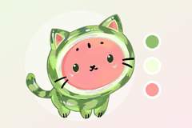

# Sweet No Sleep — Kiwi Cat

A native macOS companion that keeps your Mac awake during long work
sessions and makes it pleasant to look at. A small floating cat —
Kiwi or Kot-Arbuz, your pick — lives on your desktop, reacts to what
you do, and holds a power assertion while you (or your coding agent)
need the machine to stay awake.

No menus to learn, no accounts, no network calls. Just a pet that
watches over your focus time.

## Release media


[Download the 1280 × 640 banner PNG](Resources/Art/Rendered/banner.png) · [editable banner SVG](Resources/Art/banner.svg) · [Open Graph SVG](Resources/Art/og-image.svg). The SVG files are the editable sources; `Scripts/render-media.sh` rebuilds raster assets on macOS. A successful macOS CI push commits the generated images to the task branch and uploads the media kit as an artifact.

## The cats

Two characters live in the app, and each one keeps its own name.

**Kiwi** is the original — a warm-furred cat drawn procedurally on a
Canvas, with breathing, blinking, a swaying tail, and eyes that follow
your pointer. He comes in three looks — Kiwi, Moonlight, and
Strawberry — each a palette pack over the same drawing, so switching
looks changes the mood without changing the pet.

**Kot-Arbuz** is the watermelon cat: a layered sprite character cut from
his own artwork, with a striped rind, a red heart, and a palette that is
his alone. He celebrates with leaves, sways his tail while agents run,
and lights an amber question mark the moment one of them needs your
approval — and he never answers to the name Kiwi.



See the [Kot-Arbuz character case on dajet.ru](https://dajet.ru/#project-16)
for the design, the sprite layers, and the app states side by side.

## Features

- **Kiwi, the floating pet.** A transparent always-on-top panel with
  a hand-drawn Canvas pet: breathing, blinking, a swaying tail,
  pointer-following eyes, click reactions, and drag-to-move.
  Stays across Spaces, remembers its position, never steals focus
  from your editor.
- **Focus sessions and manual awake mode.** Run a timed session from
  15 minutes to 4 hours, or flip manual awake mode on with no timer.
  On completion, either release the assertion and let macOS resume
  its normal sleep settings, or put the Mac to sleep immediately
  (with per-session confirmation).
- **Four built-in characters.** Kiwi, Moonlight, and Strawberry are
  palette packs for the procedural cat; **Kot-Arbuz** ("Watermelon
  cat") is a layered sprite character with its own breathing body and
  wagging tail. All four keep the same panel behaviour, moods, and
  agent cues. Add your own packs without touching app source; see
  `docs/SKIN_AUTHORING.md`.
- **Emotions and playful moments.** Kiwi dances, stretches, and gets
  curious roughly every 3.5-6.5 minutes during a session. Gentle
  break reminders arrive every 25 minutes by default (snooze,
  dismiss, or disable). Respects system Reduce Motion.
- **Agent bridge (opt-in, local only).** An off-by-default URL-scheme
  bridge (`sweetnosleep://`) lets coding agents and IDE hooks hold
  awake with `start`, minute-interval `heartbeat`, a `waiting` event
  when approval is needed, and terminal `done` / `failed` events. A
  3-minute heartbeat lease means a lost hook never keeps the Mac
  awake forever.
- **Agent awareness on the pet.** A light and an active-session pip row
  sit on the chest badge, the pet breathes quicker while agents work,
  and a waiting agent raises a paw with an amber `?` glyph and a y/n
  bubble. The menu-bar dashboard lists every session with its state
  and age. See `docs/images/agent-awareness-states.png` for the three
  states side by side.
- **Power done right.** App Nap friendly activity plus
  `PreventUserIdleSystemSleep` assertions. Optional separate display
  control: keep the Mac awake while allowing the display to sleep.
  Launch at login supported.

## Install and run

Requirements: macOS 14 or later, Xcode 16 or later with the
Swift 5.9 toolchain.

```bash
# Run straight from source
swift run --package-path /path/to/sweet-no-sleep

# Or build a local .app bundle
cd /path/to/sweet-no-sleep
./Scripts/build-app.sh
open "dist/Sweet No Sleep — Kiwi Cat.app"
```

`Scripts/build-app.sh` compiles a release binary, assembles a
minimal `.app`, copies skin and localization resources, and ad-hoc
signs it for local use. Keep the app at a stable path if you enable
launch at login. Public distribution needs Developer ID signing,
notarization, and an app icon.

Validate the checkout before building:

```bash
./Scripts/check-project.sh
```

On macOS this also runs `swift build` and a borderless-panel
roaming smoke test. See `docs/CODE_AUDIT.md` for the Mac acceptance
checklist.

## Settings overview

Open the menu-bar item and choose **Settings** (the app window, not
a macOS system pane). Three sections:

- **Focus.** Session duration, completion behavior (release
  assertion vs. immediate sleep), and manual awake mode.
- **Pet.** Skin picker, size (45-170 pt), visibility, window level,
  screen roaming (off by default; first stroll about 3 seconds
  after enabling, then roughly every 28 seconds), animation,
  playful moments, and break reminders. Drag Kiwi to reposition.
- **Power.** Display sleep control, battery safety floor, continuous
  awake cap, hold diagnostics, opt-in agent hooks
  (**Settings -> Power -> Allow events from local hooks**), and
  launch at login.

To install a custom skin: **Settings -> Pet -> Open skins folder**,
copy in a directory containing `skin.json`, press **Refresh list**,
and pick its card. Kot-Arbuz ships inside the app bundle, so it is
selectable from the same **Pet** grid with no extra downloads.

## Verify sleep protection

Start manual awake mode or a focus session, then run:

```bash
pmset -g assertions | grep "pid $(pgrep -x SweetNoSleep)"
```

or:

```bash
pmset -g assertions | grep -A4 -B2 -i "Sweet No Sleep"
```

You should see the app's `PreventUserIdleSystemSleep` assertion,
plus a display assertion if **Keep the display on during a session**
is enabled. Note the `Timeout` field (assertions are created with
a 120-second fail-safe kernel timeout and automatically re-armed at
~90 seconds). Stop the session and confirm the entries disappear.

## AI agents and sleep

Sleep protection covers **idle system sleep** only. It cannot
override a user sleep command, a closed MacBook lid, critical
battery shutdown, or other macOS policies.

The app never guesses agent state from open editor windows. Instead,
use the wrapper for agent commands (sends `start`, heartbeats every
60 seconds, then `done` or `failed`):

```bash
./Scripts/agent-session.sh my-agent-123 -- ./run-my-agent.sh --your-args
```

Or call lifecycle events directly from IDE hook callbacks, reusing
one session ID and heartbeating about once a minute (including
while waiting for approval):

```bash
./Scripts/agent-event.sh start "$SESSION_ID"
./Scripts/agent-event.sh heartbeat "$SESSION_ID"
./Scripts/agent-event.sh waiting "$SESSION_ID" "Approve deploy?"  # needs you
./Scripts/agent-event.sh done "$SESSION_ID"    # success
./Scripts/agent-event.sh failed "$SESSION_ID"  # error or cancellation
```

### See agent awareness in one command

Enable **Settings → Power → AI agent connection**, then run the demo
against the bundled hooks (it only opens `sweetnosleep://` URLs, so the app
must be running):

```bash
./Scripts/agent-event.sh start a1                    # green light + count 1
./Scripts/agent-event.sh start a2                    # count 2
./Scripts/agent-event.sh waiting a1 "Approve deploy?"   # amber light, paw up, ? glyph, y/n bubble
./Scripts/agent-event.sh done a1                     # count back to 1, light green
./Scripts/agent-event.sh done a2                     # idle, light off
```

What to watch, in order:

- **Count.** A pip appears under the chest badge (tinted by state) the moment
  the first event arrives, and one more per active session ID; past five it
  becomes a capped `5+` row, so it can never grow across the pet. Filled dots
  stay legible at the 45 pt minimum pet size and sit below the face, never
  over the eyes. The menu-bar dashboard grows an **AGENTS AT WORK** row per
  session (waiting sessions first, amber) with a short ID and age.
- **Waiting cue.** The badge turns amber, the pet raises a paw (the sprite
  character leans and lifts its tail), a double-stroked `?` appears, and a
  bubble offers **Approve** / **Not now**. Both buttons only close the bubble;
  the agent still waits in its own window. The dashboard title switches to
  **AGENT NEEDS APPROVAL** and repeats the question.
- **Quiet cues.** Working sessions make the pet breathe a bit quicker with a
  small work bob.

Reduce Motion (system, or **Settings → Pet → Animations**) freezes all of the
above into a static, still-readable state. Turning off **Show the status light
and active-agent count on the pet** hides the light and the count; the waiting
pose and bubble are driven by the waiting event itself.

With two copies of the app installed under the same bundle identifier, a
`sweetnosleep://` URL is delivered to one registered handler — whichever copy
macOS considers current — so run the demo against a single instance.

### Presets

Drop-in hook and task presets live in `presets/` and are installed by
`Scripts/install-presets.sh`:

```bash
./Scripts/install-presets.sh --list                    # show preset files
./Scripts/install-presets.sh --claude-user             # ~/.claude/settings.json (merged)
./Scripts/install-presets.sh --claude-project /path    # <dir>/.claude/settings.json
./Scripts/install-presets.sh --tasks /path             # <dir>/.vscode/tasks.json
```

The Claude Code presets (`presets/claude-code.settings.json`,
`presets/claude-code-hooks.settings.json`) map session start/stop, waiting for
approval, and tool errors onto `agent-event.sh`; `presets/tasks.json` does the
same for Cursor/VS Code tasks. All of them use one `$SESSION_ID` per task, so
the pet shows one session per running agent.

The bridge is unauthenticated local IPC: any local process that can
open the URL scheme may send events. Enable it only for trusted
hooks. Agent events can release an assertion but never trigger
immediate sleep.

## Localization

`Sources/SweetNoSleep/Localizable.xcstrings` is the English source
catalog; visible strings go through `L10n.text` / `L10n.format`.
Checks:

```bash
python3 Scripts/validate-skins.py /path/to/a-skin-pack
python3 Scripts/validate-localization.py
```

Extra locales are generated via `Scripts/localize.sh` (Crowdin CLI,
CI-supplied credentials), never hand-edited. This checkout ships
English source strings only.

## Docs

- `docs/RESEARCH.md` — design notes, power-management limits,
  agent integration guidance, roadmap.
- `docs/SKIN_AUTHORING.md` — skin pack schema, character packs (format 2),
  and installation.
- `docs/PET_DRAWING_GUIDE.md` — how the pet is drawn.
- `docs/CODE_AUDIT.md` — audit findings and Mac acceptance
  checklist.
- `docs/IMPROVEMENTS.md` — prioritized improvement ideas with
  proposed solutions and acceptance criteria.

## Project layout

```text
Sources/SweetNoSleep/
  SweetNoSleepApp.swift      # MenuBarExtra, lifecycle, dashboard
  SweetNoSleepModel.swift    # shared state, sessions, reminders, skins
  PetSkinDefinition.swift    # JSON schema and pack loading
  KiwiPetView.swift          # Canvas pet, gaze, reactions
  PetPanel.swift             # transparent NSPanel, roaming, position
  PanelOriginAnimator.swift  # eased movement, persisted origin
  PowerKeeper.swift          # App Nap activity, IOPM assertions
  SettingsView.swift         # Focus, Pet, Power settings
  Localization.swift         # NSLocalizedString access
  Localizable.xcstrings      # English source strings
  AgentIndicator.swift       # badge light, session count, waiting glyph
  CharacterSprite.swift      # decoded sprite layers for a character pack
  SpriteCharacterRenderer.swift # breathing/wag draw path for characters
  PetShapes.swift            # shared path helpers (leaves, stars, hearts)
Resources/PetSkins/          # kiwi, moonlight, strawberry, kot-arbuz packs
Resources/Art/               # pet-template.svg, banner art slot
Scripts/build-app.sh         # .app bundle assembly
Scripts/check-project.sh     # portable checks + swift build on Mac
Scripts/agent-event.sh       # single agent lifecycle event
Scripts/agent-session.sh     # wrapped command with heartbeat
Scripts/install-presets.sh   # install Claude Code / VS Code hook presets
Scripts/prepare-character-assets.py # derive sprite layers + preview from art
presets/                     # Claude Code hooks, VS Code tasks
```

---

Built by Axiiom Studio (https://axiiom.ru), part of https://dajet.ru.
