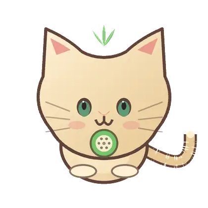

# Sweet No Sleep — Киви Кот

Нативное macOS-приложение, которое не даёт Mac уснуть во время долгой
работы и радует глаз. На рабочем столе живёт маленький питомец — Киви
или Коть-арбуз, он реагирует на происходящее и держит assertion,
пока вам (или вашему ИИ-агенту) нужен бодрствующий компьютер.

Никаких меню для изучения, аккаунтов и сетевых запросов. Просто питомец,
который охраняет ваше фокусное время.

[English version](README.md)

<p align="center">
  
  
</p>

**Живёт на рабочем столе.** Оба кота дышат, моргают, ходят, а их глаза
следят за курсором. Пока работает ИИ-агент — зелёная искра и счётчик
сессий; когда агент ждёт вашего ответа — янтарный знак вопроса и
пузырь с кнопками.

## Возможности

- **Два персонажа, три образа у каждого.** Киви — плоский векторный кот
  (Киви / Moonlight / Strawberry); Коть-арбуз — нарисованный от руки
  арбузный кот на послойном риге (Арбуз / Лунная пыль / Земляничный).
- **Живой.** Дыхание, мигание, походка, покачивание головы, взгляд за
  курсором, игривые моменты, праздничные частицы (листики, лунная пыль,
  ягодные сердечки). 60 fps, уважает Reduce Motion.
- **Заметность агентов.** Зелёная искра и пипсы, пока агенты работают;
  янтарный «?», поднятая лапа и пузырь y/n, когда агент ждёт ответа.
- **Три моста для агентов:** URL-схема `sweetnosleep://`, локальный вебхук
  (127.0.0.1:18290, Bearer-токен), MCP-сервер — плюс скрипт-обёртка для
  агентов без хуков. Аренда heartbeat означает: потерянный агент никогда
  не удержит Mac вечно; всё страхуют глобальный лимит бодрствования и
  батарейный пол.
- **Фокус-сессии** 15–240 минут с опциональным немедленным сном по
  завершении; ручной режим; напоминания о перерыве; прогулки; папка
  скинов для новых персонажей.

## Установка

1. Скачайте **Sweet-No-Sleep-Kiwi-Cat-1.0.0-macOS.zip** на странице
   [релиза](https://github.com/bestdeejay-design/sweet-no-sleep/releases).
2. Распакуйте и перенесите приложение куда угодно (хоть на Рабочий стол).
3. Первый запуск: правый клик → **Открыть** (сборка подписана ad-hoc,
   без нотаризации). Нужен macOS 14+.

## Для агентов и автоматизации

Включите **Settings → Power → Allow events from local hooks**, затем:

```bash
./Scripts/agent-session.sh my-agent -- ./ваш-агент
```

Или используйте вебхук, MCP-сервер и пресеты из `presets/` и `mcp-server/`.

## Сборка из исходников

```bash
git clone https://github.com/bestdeejay-design/sweet-no-sleep
cd sweet-no-sleep && ./Scripts/build-app.sh
```

## Языки интерфейса

Английский (исходник), русский, испанский, корейский, китайский
(упрощённый), японский — приложение следует языку системы. Чтобы задать
язык отдельно для приложения: Настройки macOS → Основные → Язык и регион
→ «Приложения».

## Лицензия

**CC BY-SA 4.0** — используйте, изучайте, модифицируйте и
распространяйте, но обязательно указывайте ссылку на
[bestdeejay-design/sweet-no-sleep](https://github.com/bestdeejay-design/sweet-no-sleep)
и распространяйте производные под той же лицензией.

Сделано в Axiiom Studio · кейс персонажей: https://dajet.ru/#project-16
